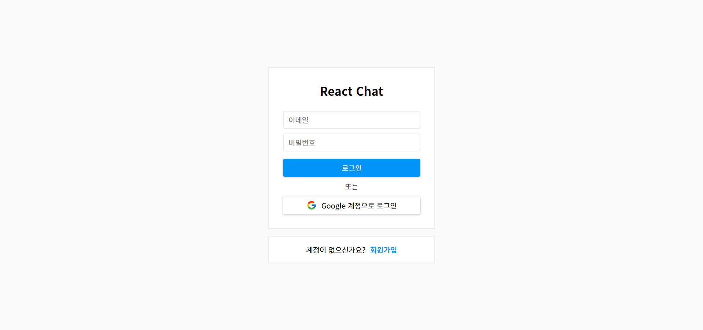
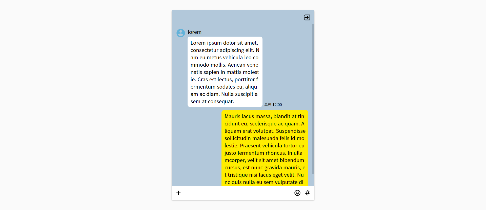

# React Chat

리액트와 타입스크립트를 활용한 React Chat 프로젝트.

[React Chat 데모 페이지](https://yeouya.github.io/react-chat)

## 목차

- [기술 스택](#기술-스택)
- [구현 기능](#구현-기능)
- [프로젝트 진행 중 어려웠던 점](#프로젝트-진행-중-어려웠던-점)
- [프로젝트 후기](#프로젝트-후기)

## 기술 스택

- React
- TypeScript
- CSS Module

## 구현 기능

- [x] 로그인, 회원가입, 로그아웃
- [x] 실시간 채팅

## 프로젝트 진행 중 어려웠던 점

파이어베이스 사용법을 익히는 부분이 가장 어려웠다.

하나 더 꼽자면 채팅창 스타일링 정도.

## 프로젝트 후기

파이어베이스가 다양한 백엔드의 기능을 빠르게 구현할 수 있다는 장점이 있고

그런 장점이 이번 프로젝트를 진행하는데 있어 큰 도움이 되었지만

파이어베이스를 사용하면서 오히려 백엔드를 더 열심히 공부해야겠다는 생각이 들었다.

뭔가 온전한 내 서비스가 아닌 것 같다는 느낌..

백엔드 공부를 우선시하되, 사이드 프로젝트를 위한 파이어베이스 공부도

틈틈이 해놓으면 좋을 것 같다.
